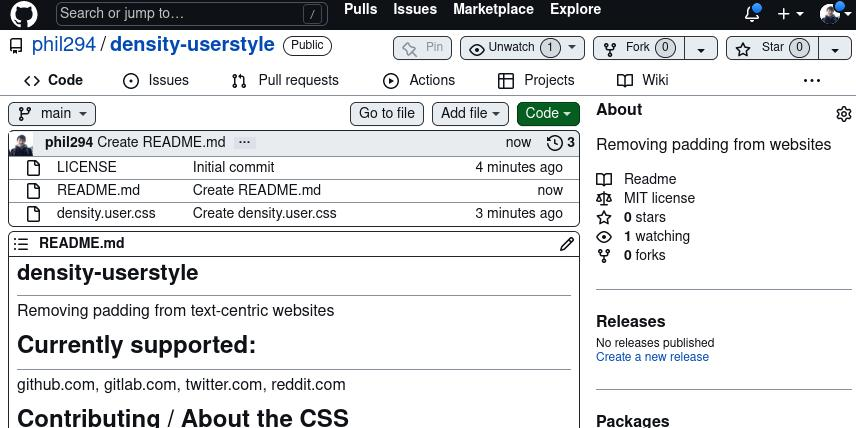

# density-userstyle
Removing padding from text-centric websites.

Example for `github.com`:

([GitLab demo screens here](https://github.com/phil294/Gitlab-with-less-padding))

## Install

Open the raw css file, or [install from userstyles.world here](https://userstyles.world/style/6295/density). When installing from userstyles.world, it should auto-update.

## Currently supported:
`github.com`, `gitlab.com`, `twitter.com`, `reddit.com`

## Contributing / About the CSS

Philosophy: It doesn't have to look perfect, just reduce the space. Don't worry much about the CSS rules becoming outdated. It's fine for the stylesheet to be bloated, as long as it defeats the spacing nonsense. Also don't worry about syntactic nuances or repetition. Website owners usually don't as well, and style sheets are often short-lived anyway.

Pull requests are welcome, even low effort or incomplete ones, as long as it somewhat works. Just add a new section for the respective website if it does not exist yet (also add to site list above). Regarding *how much* spacing should be kept/removed: Often `{padding:0}` looks too crammed, so usually `2px` - `10px`, depending on where/what, works well. When in doubt, orient yourself on the (modified) GitHub appearance. Please check both Chrome and Firefox, if possible, and perhaps different resolutions (resize browser window). It's also fine to increase gaps again if you think something looks bad, just send a PR. Issues not necessary. If class names are obfuscated, it might be better to choose element name / nesting selectors instead, in case they completely change with the next website update.

The website's layout should generally stay untouched, including cookie banners etc. (there's separate extensions for that).

Text should fill all available horizontal space at all time (e.g. tweets on Twitter). You can always shrink the browser window if you prefer a max width. (Note that you can also exclude websites with Stylus from a user style sheet in the context menu)
